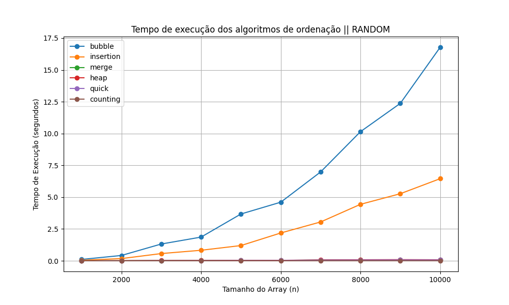

# Análise de algoritmos de ordenação

Este projeto realiza a análise de performance de diferentes algoritmos de ordenação, medindo o tempo de execução de 
algoritmo em diferentes tamanhos de entrada e gerando gráficos para ilustrar os resultados.


## Table of Contents

- [Informações](#informações)
- [Instalação](#Instalação)
- [Como executar](#como-executar)
- [Funcionalidades](#funcionalidades)
- [Exemplo de saída](#exemplo-de-saída)
- [Autores](#autores)


## Informações
### Foram implementados os seguintes algoritmos de ordenação: 
- BUBBLESORT 
- INSERTIONSORT 
- MERGESORT 
- HEAPSORT 
- QUICKSORT  
- COUNTINGSORT

### Onde são testados em 4 tipos de arrays:
- Array aleátorio 
- Array reverso
- Array ordenado
- Array quase ordenado (onde 10% dos valores de um array ordenado são embaralhados)

#### Exclusivamente para o tipo de array aleátorio, o algoritmo é executado em 10 arrays diferentes e disso é tirado uma média do tempo de execução
###### - A quantidade de execuções aplicado ao array aleátorio pode ser alterado usando: 
###### "--rpt quant_execuções", exemplo: "python -m src.main 1000 10000 100 --rpt 50"

## instalação


### 1. Clone o repositório:

``` commandline
git clone https://github.com/seu-usuario/seu-projeto.git
cd seu-projeto
```

### 2. Crie e ative um ambiente virtual (opcional, mas recomendado):

```
python -m venv venv
source venv/bin/activate  # Linux/Mac
venv\Scripts\activate     # Windows
```

### 3. Instale as dependências
#### As dependências estão listadas no arquivo requirements.txt. Para instalá-las, execute:

```commandline
pip install -r requirements.txt
```


## Como executar
#### Os gráficos gerados serão salvos automaticamente na pasta graphs.

### Rodando via Terminal
1. Navegue até a pasta do projeto (a que contém a pasta /src e a /graphs):

```
cd caminho/para/o/projeto
```
2. Dê este comando no terminal (para que na compilação seja reconhicido a pasta src):
```
set PYTHONPATH=%cd%\src
```

3. Execute o comando para rodar o programa:
```commandline
python -m src.main ínicio fim step
```
(Opcional: se caso que queira alterar o numero de repetições, utilize: "--rpt valor_desejado")
```commandline
exemplo: python -m src.main 1000 10000 100 --rpt 15
``` 


## Funcionalidades:

- Comparação de tempo de execução de algoritmos de ordenação.
- Geração de gráficos automaticamente para visualizar os resultados.
- Implementação modular que facilita a adição de novos algoritmos.


## Exemplo de saída
Os gráficos gerados pelo programa mostram o tempo de execução dos algoritmos de ordenação com diferentes tamanhos de entrada. Eles são salvos automaticamente na pasta graphs.

- Exemplo de gráfico gerado


O progama também gera tabelas em .csv do tempo de execução dos algoritmos de ordenação. As tabelas ficam salvas na pasta tables


## Autores

- [Kauan Cardoso](https://github.com/KauanPr)  
- [Marco Menegati](https://github.com/MMenegati)